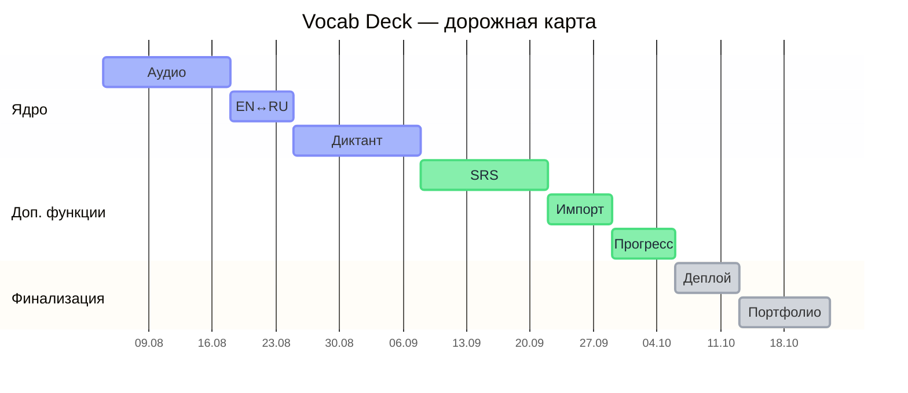

# Roadmap

План развития Vocab Deck на ближайшие ~11 недель. Порядок фаз выбран так, чтобы каждая следующая функция опиралась на предыдущую: сначала обогащаем данные о словах (транскрипция + аудио), потом строим на этой базе обратный режим и диктант, а системы вроде интервальных повторений добавляем уже поверх готового фундамента.

*Цвет полоски = этап: лавандовый — Ядро, мятный — Доп. функции, серый — Финализация. Полные названия фаз и даты — в таблице ниже.*

| Этап | Фаза | Сроки | Длительность |
|---|---|---|---|
| 🟪 Ядро | Транскрипция + аудио произношение | 04.08 – 17.08 | 2 недели |
| 🟪 Ядро | Режим EN→RU и RU→EN | 18.08 – 24.08 | 1 неделя |
| 🟪 Ядро | Диктант — печатать слово на слух | 25.08 – 07.09 | 2 недели |
| 🟦 Доп. функции | Интервальные повторения (Лейтнер) | 08.09 – 21.09 | 2 недели |
| 🟦 Доп. функции | Свои списки слов / импорт | 22.09 – 28.09 | 1 неделя |
| 🟦 Доп. функции | Статистика прогресса | 29.09 – 05.10 | 1 неделя |
| ⬜ Финализация | Полировка, доступность, деплой | 06.10 – 12.10 | 1 неделя |
| ⬜ Финализация | Оформление под портфолио | 13.10 – 22.10 | ~1.5 недели |

## Фазы

### 1. Данные слов: транскрипция + аудио — 2 недели
Каждое слово получает поле IPA-транскрипции и озвучку через Web Speech API (кнопка «прослушать»). Это база для всех следующих фаз — без неё не построить ни обратный режим, ни диктант.

### 2. Режим EN→RU и RU→EN — 1 неделя
Переключатель направления: то же слово показывается либо на английском (нужно вспомнить перевод), либо на русском (нужно вспомнить английское слово). Прогресс считается отдельно по каждому направлению — это и есть многомерное запоминание, о котором была идея.

### 3. Диктант на слух — 2 недели
Проигрывается аудио, пользователь печатает слово по буквам, приложение сверяет ввод и подсвечивает ошибки. Самая техническая часть — обработка ввода и сравнение строк с учётом опечаток.

### 4. Интервальные повторения (алгоритм Лейтнера) — 2 недели, опционально
Вместо двух корзин — несколько уровней, слова показываются реже по мере того, как их всё увереннее вспоминают.

### 5. Свои списки слов — 1 неделя, опционально
Форма добавления собственных слов, импорт из CSV/текста.

### 6. Статистика прогресса — 1 неделя, опционально
График выученных слов по дням, streak-счётчик.

### 7. Полировка и деплой — 1 неделя
Адаптивность, доступность (клавиатурная навигация, контраст), финальный деплой на GitHub Pages.

### 8. Оформление под портфолио — 1 неделя
Скриншоты/GIF в README, разбор технических решений, ссылка на демо.
